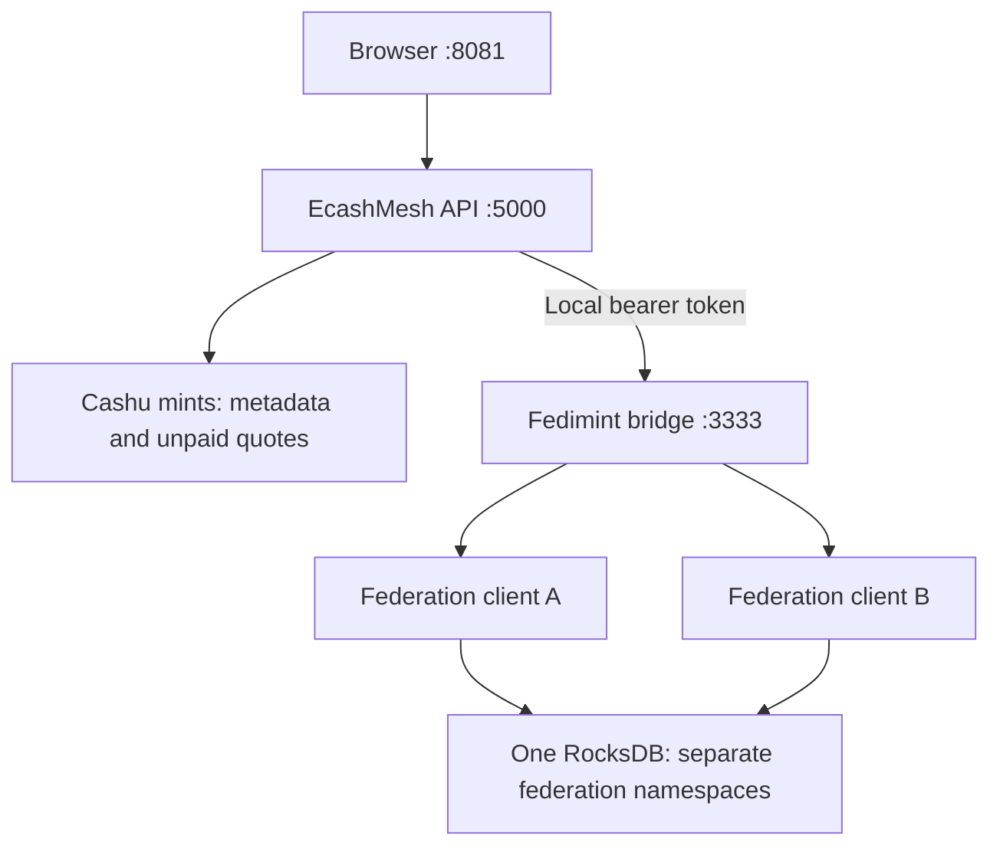

# EcashMesh

**One payment. More options.** Compare fees across Cashu mints and Fedimint
federations from a single screen.

The demo reads live fees without sending a payment. Empty wallets can still
appear in comparisons. Each result says what its fee includes.

## Start the demo

Install Nix first. Its development shell provides Rust, Node.js and npm.
Run these commands from the repository root.

Build and install dependencies once, and again after dependency changes:

```sh
./scripts/demo.sh build
```

Then use three terminals:

```sh
# Terminal 1 — local Fedimint clients, port 3333
./scripts/demo.sh bridge
```

```sh
# Terminal 2 — API, port 5000
./scripts/demo.sh api
```

```sh
# Terminal 3 — browser app, port 8081
./scripts/demo.sh web
```

Open [localhost:8081](http://localhost:8081). Stop each process with Ctrl+C.
After changing Rust code, rebuild and restart the affected process. The frontend
reloads source changes; restart it after changing environment variables.

## A two-minute walkthrough

1. Open **Manage payment sources**. Add Cashu mint URLs and connect the
   federations you want to compare. Use **Save locally**; Nostr sync is optional.
2. Select **Compare a payment**. Enter an amount and a fresh Lightning invoice
   for that amount.
3. Leave **Include sources with no balance** enabled. Select **Compare fees**.
4. Show the ordered results. Open **Fee details** or **Not included** only when
   explaining a particular source.

Only enabled sources in the browser's list are considered. An empty source
list stays empty. Joining a federation is always an explicit action.

## What the result means

| Result                        | What is known                                                                            |
| ----------------------------- | ---------------------------------------------------------------------------------------- |
| Cashu fee reserve             | The mint's current reserve; final fees may differ and proof input fees may be additional |
| Fedimint gateway fee          | The verified gateway's fee; federation fees are not included                             |
| Fedimint payment fee estimate | A native fee quote using the local client's actual notes                                 |

Comparison orders the listed fees from low to high, ignoring wallet balances.
A partial fee can rank first without being the lowest total payment cost.
Every comparison has `executable: false`. Unknown balances remain unknown;
missing fees are never turned into zero fees.

Turning off **Include sources with no balance** opens normal payment evaluation.
That path retains its existing quote and funding checks. A Cashu quote alone
still does not prove the browser owns spendable funds.

## Architecture



The bridge uses the pinned **Fedimint v0.12.1** libraries: one process, one
mnemonic, one database, many clients. It has no payment endpoint. The API keeps
its token server-side; the browser stores source references and preferences.

- [Architecture and API](docs/architecture.md): code map, ranking modes and boundaries.
- [Connect federations](docs/federation-connection.md): invite flow and local persistence.
- [Manage sources](docs/source-registry.md): local storage and optional Nostr sync.
- [Frontend development](apps/reference-wallet/README.md): browser tests and configuration.
- [Regtest development](docs/regtest.md): optional local payment testing, outside the demo.

## Troubleshooting

| Problem                            | What to do                                                                        |
| ---------------------------------- | --------------------------------------------------------------------------------- |
| `npm: command not found`           | Use the demo script or run npm inside `nix develop`                               |
| Bridge appears to do nothing       | It is a foreground server. Check `curl http://127.0.0.1:3333/health`              |
| API cannot see joined federations  | Start bridge and API with the same home directory; the script sets the token path |
| Invoice expired or amount mismatch | Create a fresh invoice for the amount entered                                     |
| No comparison for a source         | Open **Not included**; check the gateway or quote failure                         |
| Insufficient Fedimint balance      | Keep balance-independent comparison enabled; native funding quotes need notes     |
| Port already in use                | Stop the previous process in its terminal before restarting                       |

## Checks

```sh
nix develop -c cargo fmt --check
nix develop -c cargo check --workspace
nix develop -c cargo test --workspace
nix develop -c cargo clippy --workspace --all-targets -- -D warnings
nix develop -c npm --prefix apps/reference-wallet run typecheck
nix develop -c npm --prefix apps/reference-wallet test
nix develop -c npm --prefix apps/reference-wallet run test:e2e
```
