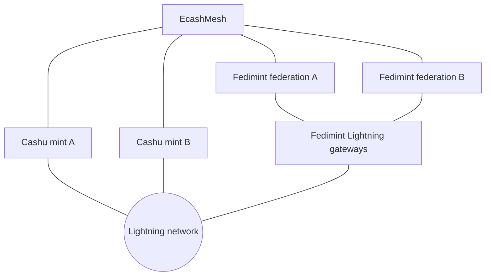
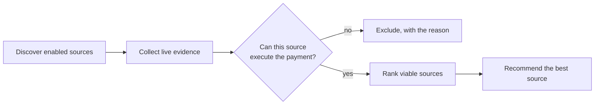

# EcashMesh

**BOSS Battle 2026 · Track 03: Freedom Stack (Nostr + Ecash)**

▶ **Demo video (4 min):** _add the video link here_

## Interoperability across Cashu and Fedimint

Ecash today is siloed: ecash from one Cashu mint or Fedimint federation can
only be spent where that mint or federation is accepted. **EcashMesh connects
independent ecash systems** so value can move between them, using Lightning as
the common settlement layer.

EcashMesh runs a real interoperability mesh on Bitcoin regtest:
**4 Cashu mints and 4 Fedimint federations**, each with its own Lightning
infrastructure. From a clean start, **all 56 directed source-to-source
payments settle** — every mint and federation pays every other one, with real
Lightning payments and verified credit at the destination.

The next layer is **intelligent source selection**: using live evidence to
decide which of a user's ecash sources can execute a payment and which one is
the best choice. Its experimental foundation — evidence collection, Lightning
probing, feasibility checks and ranking — is already in this repository.

## How the mesh works



Each Cashu mint has its own Lightning node; each federation reaches Lightning
through its own gateway. A cross-source payment goes:

```text
payment request
      ↓
EcashMesh
      ↓
source ecash system     Cashu melt  /  Fedimint LNv2 send
      ↓
Lightning network       a real payment over real channels
      ↓
destination system      Cashu mint quote  /  Fedimint LNv2 receive
      ↓
settlement              new ecash issued and verified at the destination
```

Every step uses the native protocol of the system involved (CDK for Cashu,
pinned Fedimint v0.12.1 clients for Fedimint). EcashMesh does not replace
either protocol; it connects them.

## Proven: 56 of 56 routes

The regtest lab has **8 ecash sources**. Each one pays each of the other 7
(self-routes are excluded): **8 × 7 = 56 directed payments**.

| Route class | Routes | Source pays with | Destination receives with |
|---|---|---|---|
| Cashu → Cashu | 12 | Cashu melt | Cashu mint quote, proofs issued |
| Cashu → Fedimint | 16 | Cashu melt | Fedimint LNv2 receive, claimed |
| Fedimint → Cashu | 16 | Fedimint LNv2 send via its gateway | Cashu mint quote, proofs issued |
| Fedimint → Fedimint | 12 | Fedimint LNv2 send via its gateway | Fedimint LNv2 receive, claimed |

A route counts as successful only when the Lightning payment settles and the
destination's credit is verified. Results from a clean lab:

```text
TOTAL: 56 SUCCEEDED: 56 FAILED: 0
```

This validates real interoperability, not just API compatibility: the mints,
federations, gateways and Lightning nodes are independent processes with their
own keys, databases and channels.

## Current and future

| Current — demonstrated | Future |
|---|---|
| Cashu → Cashu payments | Automatic source selection for every payment |
| Cashu → Fedimint payments | Evidence-weighted ranking as the default decision |
| Fedimint → Cashu payments | Execution-aware recommendations across the mesh |
| Fedimint → Fedimint payments | Adaptive selection from accumulated payment history |
| Real Lightning settlement with verified destination credit | Interoperability on live networks, not only regtest |
| Clean-start topology validation and the 56-route matrix | Additional ecash protocols |
| Read-only discovery and fee quotes for real mints and federations | |
| Nostr source list: NIP-60 import, encrypted NIP-78 sync, NIP-87 discovery | |
| Evidence collection and diagnostics (experimental selection layer) | |

## Run it

**Prerequisites:** macOS or Linux (x86_64 or arm64), [Nix](https://nixos.org/download)
with flakes enabled, Python 3, and git. Nix provides the pinned Rust, Node.js
and tools; nothing else needs installing. The regtest lab compiles pinned
Fedimint, CDK and LND from source: allow plenty of free disk (about 100 GB to
be safe) and an hour or more for the first run. Run commands from the
repository root.

```sh
git clone https://github.com/bansalayush247/ecashmesh.git && cd ecashmesh
```

### Regtest lab — the interoperability mesh

```sh
./scripts/ecashmesh-lab-up.sh
```

This builds and starts everything — `bitcoind`, 4 federations with their
gateways, 4 Cashu mints with their Lightning nodes, the channels between them —
proves routing, and then runs the 56-route matrix. It ends with
`Verified sources: 8 (4 Cashu + 4 Fedimint)`. The first run compiles pinned
Fedimint, CDK and LND from source and takes a long time; later runs take
roughly 10–15 minutes.

Check the result:

```sh
tail -1 .regtest/ecashmesh-lab/route-executor.log   # TOTAL: 56 SUCCEEDED: 56 FAILED: 0
```

Then demo it in the web app:

```sh
nix develop -c cargo build -p ecashmesh-fedimint -p ecashmesh-api
./scripts/ecashmesh-lab-services.sh start            # restart after every lab-up
EXPO_PUBLIC_ENABLE_INTEROPERABILITY_LAB=true ./scripts/demo.sh web   # http://localhost:8081
```

1. **Home** shows the mesh: the 8 sources with live balances and the 56/56
   result (expand **All 56 verified routes** for each route).
2. **Make a payment** → under **Who gets paid?** pick a mint or federation
   (e.g. Cashu B) → **Generate invoice** → **Check payment options**. The 7
   other sources are ranked; each card shows its route fee against the
   routing-fee budget of the gateway or mint that would pay it.
3. **Review option** → **Pay for real on regtest**. The receipt shows the
   source's balance going down and the destination's going up, with the
   destination credit claimed and verified.
4. Back on **Home**, **Set the gateway fee to 0** (Fedimint A), then pay
   Cashu B again: Fedimint A is listed under **Not included** with the reason.
   **Try paying with Fedimint A** shows its gateway refusing the route for
   real. **Restore the gateway fee** afterwards.

Stop everything:

```sh
./scripts/ecashmesh-lab-services.sh stop
./scripts/ecashmesh-lab-down.sh
```

See [docs/regtest-lab.md](docs/regtest-lab.md) for the topology and each step.

### Live mode — real mints and federations, read-only

Live mode connects to real public Cashu mints and Fedimint federations, reads
their live quotes and gateway information, and compares them for a Lightning
invoice. **It never makes a payment.**

```sh
./scripts/demo.sh build      # once
./scripts/demo.sh bridge     # terminal 1 — Fedimint bridge, port 3333
./scripts/demo.sh api        # terminal 2 — API, port 5000
./scripts/demo.sh web        # terminal 3 — http://localhost:8081
```

In the app: **Manage payment sources** → add mint URLs / connect federations →
**Compare a payment** → enter an amount and a fresh Lightning invoice for it.
See [docs/live-mode.md](docs/live-mode.md).

## Future: intelligent source selection

A user with ecash in several mints and federations has to decide which one
should pay. The next layer of EcashMesh makes that decision automatically,
while respecting what each source can really execute:



The selection considers fees, Lightning liquidity, routing cost and the
routing-fee budget of the paying gateway or mint, reliability from real
payment history, evidence freshness, federation solvency (guardian audits) and
historical behaviour. Unknown or conflicting evidence is penalised — never
treated as zero or as good.

**Experimental infrastructure already in place:**

- `POST /v1/routes/evaluate` collects evidence for each enabled source,
  excludes sources that cannot fund the payment, cannot route it, or whose
  route costs more than their routing-fee budget, then ranks the rest with an
  explanation for every decision ([architecture](docs/architecture.md)).
- In the regtest lab: Lightning probes from each source's own node, guardian
  solvency audits, and reliability from recorded payments.
- Lab tools that check the decisions against real execution:

```sh
# (lab and services running, see above)
python3 scripts/ecashmesh-lab-rank-acceptance.py 1000 --verify-topology   # rank all 8 sources, show all evidence
python3 scripts/ecashmesh-lab-experiments.py fee_budget --amount 1000     # change one real condition, re-rank, restore
```

In the `fee_budget` experiment, a gateway with no routing-fee budget is
excluded before ranking; the recommended source then pays for real, while the
excluded gateway's own attempt is refunded — the evaluator agrees with
execution.

The longer-term goal is to **automatically select the best ecash source for a
payment while respecting real execution constraints.**

## Why Freedom Stack

Ecash is custodial; the track asks to make the trust underneath it visible.
EcashMesh does that where it can measure it, and keeps the user in control:

- **No single custodian lock-in.** Value in one mint or federation can pay into
  any other through Lightning, so leaving a custodian does not mean losing
  access to everyone who uses it.
- **Solvency is measured, not assumed.** In the lab, Fedimint guardian audits
  must agree, by threshold, that assets cover liabilities; disagreement is
  flagged. Cashu mints expose no equivalent, so their solvency is shown as
  unknown and penalised.
- **The user's source list lives on Nostr**, encrypted to their own key
  (NIP-60 import, NIP-44-encrypted NIP-78 sync, NIP-87 discovery). Discovered
  sources are never enabled automatically.

## What is not finished

- **Real payments run only on regtest.** Live mode on real mints and
  federations is read-only by design.
- **Source selection is experimental.** It is demonstrated in the lab, and it
  is not yet the default way payments are made.
- **Solvency evidence is lab-only.** Guardian audits need guardian API access.
  Cashu solvency stays unknown, and there is no cryptographic
  proof-of-reserves.
- **Reliability starts at zero** for every source. It comes only from recorded
  real payments, kept per lab run.
- **Fee scores are 0 for small payments.** Any fee of 1% or more scores 0, and
  Cashu's fee reserve is 2%; use about 10,000 sats to see fees compared.
- **The lab is heavy.** It needs a long first build and a lot of disk.
- See also [regtest-lab.md § Known limitations](docs/regtest-lab.md#known-limitations).

**Next:**
- Proof-of-liabilities and proof-of-reserves for mints, published as signed
  Nostr events, so solvency is verifiable outside the lab.
- Execute payments on live networks with user-held keys.
- Make source selection the default, learning from accumulated payment history.

Design decisions and trade-offs: [docs/design.md](docs/design.md).

## Repository

| Path | Contents |
|---|---|
| `crates/ecashmesh-cashu` | Cashu integration: mint discovery, metadata, quotes |
| `crates/ecashmesh-fedimint` | Fedimint integration: bridge with native v0.12.1 clients, quote validation, guardian audits |
| `crates/ecashmesh-lab-runner` | Regtest mesh supervisor: bitcoind, federations, gateways |
| `crates/ecashmesh-cashu-smoke-runner` | Native Cashu wallet runner used for mesh payments |
| `scripts/ecashmesh-lab-*` | Regtest mesh: bring-up, 56-route executor, validation, experiments |
| `crates/ecashmesh-api` | HTTP API: source evidence, Lightning probing, feasibility (selection layer) |
| `crates/ecashmesh-core` | Evidence model, deterministic ranking, explanations (selection layer) |
| `apps/reference-wallet` | Web app (React Native / Expo): sources, comparisons, lab route matrix |
| `scripts/demo.sh` | Live-mode launcher |

## Tests

```sh
nix develop -c cargo test
python3 -m unittest discover -s scripts/tests -p 'test_*.py'
nix develop -c npm --prefix apps/reference-wallet test
```

The regtest lab is itself the end-to-end test: it validates the full
eight-source topology and the 56-route matrix from a clean start.

## Safety

Live mode is read-only and never makes a payment. Real payments happen only in
the isolated regtest lab, which refuses to run unless
`PAYMENT_ENVIRONMENT=regtest` and listens on loopback addresses only.
Credentials stay server-side: LND is read with read-only macaroons, passwords
are passed through environment variables, and no secret appears in API
responses.

## License

Dual-licensed under [MIT](LICENSE-MIT) or [Apache-2.0](LICENSE-APACHE), at your
option.
