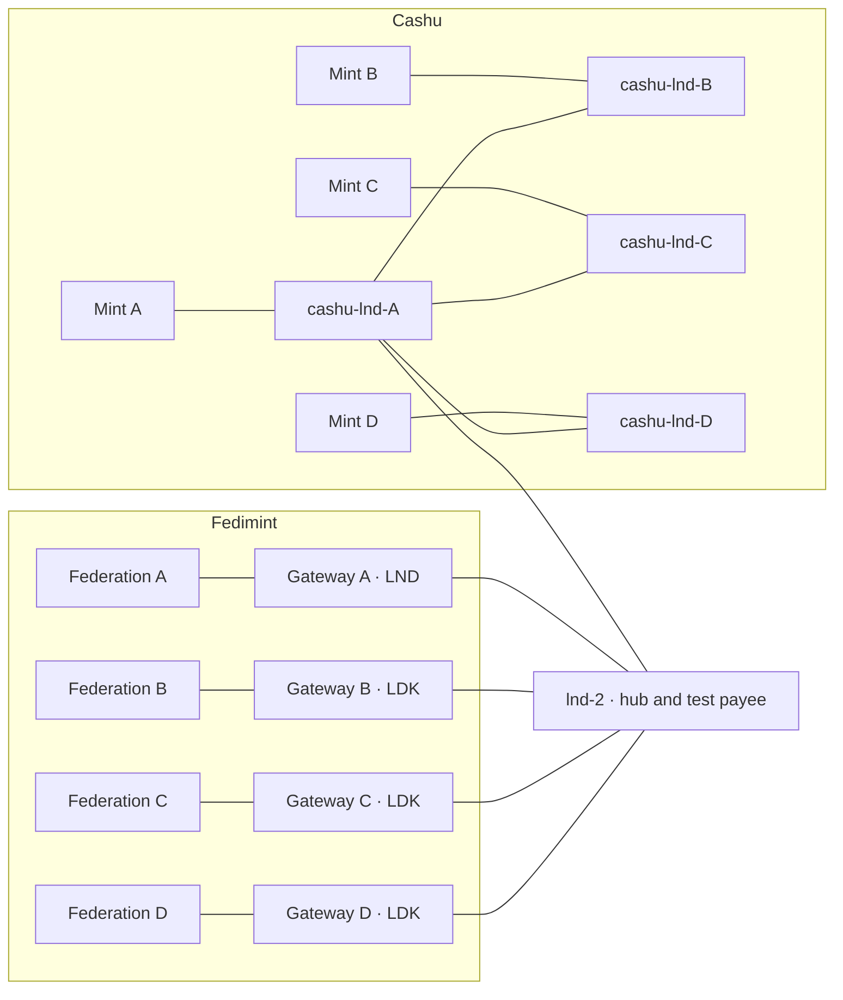

# Regtest lab

A complete, isolated payment network on Bitcoin **regtest** (local, worthless
coins), used to exercise EcashMesh with real payments and real evidence.
Everything listens on `127.0.0.1` only.

## Topology



| Part | Detail |
|---|---|
| Bitcoin | One `bitcoind` (regtest) |
| Cashu | 4 CDK mints (ports 5100–5103), each with its **own** LND node, funded and confirmed |
| Fedimint | 4 federations of 4 guardians each (pinned Fedimint v0.12.1), each with its own Lightning gateway (ports 39100–39103) |
| Lightning | Real channels as drawn; every channel is opened on-chain and must be active |

8 sources give **56 directed routes** (every source pays every other one).

## Run

```sh
./scripts/ecashmesh-lab-up.sh                 # ~10–15 min after the first (long) build
nix develop -c cargo build -p ecashmesh-fedimint -p ecashmesh-api
./scripts/ecashmesh-lab-services.sh start     # bridge :3333 + API :5000 (builds a release fedimint-cli once)

python3 scripts/ecashmesh-lab-rank-acceptance.py 1000 --verify-topology
python3 scripts/ecashmesh-lab-experiments.py fee_budget --amount 1000
EXPO_PUBLIC_ENABLE_INTEROPERABILITY_LAB=true ./scripts/demo.sh web   # http://localhost:8081

./scripts/ecashmesh-lab-services.sh stop
./scripts/ecashmesh-lab-down.sh
```

## Demo in the web app

With the lab and services running, start the app with lab mode on:

```sh
EXPO_PUBLIC_ENABLE_INTEROPERABILITY_LAB=true ./scripts/demo.sh web   # http://localhost:8081
```

The regular screens then work on the lab: the 8 lab sources are the payment
sources, invoices are generated in the payment form, and **Pay for real on
regtest** makes a real payment. Steps:

| Screen | What to do | What it shows |
|---|---|---|
| Home | — | The 8 sources with live balances; 56/56 verified routes |
| Make a payment | Pick who gets paid (external node, a mint or a federation) → **Generate invoice** → **Check payment options** | The other sources ranked; each card's route fee vs. the payer's routing-fee budget |
| Review option | **Pay for real on regtest** | Source balance down, destination balance up, destination credit verified |
| Home → experiment | **Set the gateway fee to 0**, then pay a Cashu mint again | Fedimint A under **Not included** with the reason; **Try paying with Fedimint A** is refused (refunded) by its gateway |

The app reaches the lab only through the API's lab endpoints
(`/v1/lab/sources`, `/balances`, `/invoice`, `/pay`, `/gateway-fee`). They
exist only when the API runs with `PAYMENT_ENVIRONMENT=regtest` and
`ECASHMESH_LAB_MODE=true`, use each system's native client (as the 56-route
executor does), and hold the lab executor lock.

## Before you start

Wait for `ecashmesh-lab-up.sh` to finish (it ends with `Verified sources: 8`)
before anything else, and **restart the services after every bring-up**: they
read the configuration of the lab that was running when they started. The
experiments refuse to run otherwise.

The lab is heavy (16 guardians and 9 Lightning nodes on one machine). Run one
lab command at a time: payment commands lock the lab wallets.

### What `ecashmesh-lab-up.sh` does

Each stage polls real state (no fixed sleeps) and stops with a diagnostic if
it fails.

1. Builds pinned Fedimint, CDK and LND; starts `bitcoind`, the 4 federations
   and their gateways.
2. Starts the 4 Cashu LND nodes, funds each on-chain (6 confirmations), opens
   the channels and waits until every node sees every route.
3. Proves Lightning routing with real payments between all Cashu nodes, then
   starts the 4 mints and runs Cashu→Cashu payments across distinct backends.
4. Gives gateways B–D channels, pegs ecash into every gateway (an LNv2 gateway
   needs ecash to receive), sets each gateway's fees, and proves every gateway
   can pay every node.
5. Runs the **56-route matrix**: each route is a real payment that must settle
   and credit the destination. Writes `route-evidence.json`, `results.json`
   and the signed topology attestation.

## Scripts

| Script | Use |
|---|---|
| `ecashmesh-lab-up.sh` / `ecashmesh-lab-down.sh` | Start / stop the whole lab (logs are kept) |
| `ecashmesh-lab-test.sh` | Re-verify the running lab against its attestation and re-publish `results.json` |
| `ecashmesh-lab-services.sh start\|stop` | Run the bridge and API with every lab evidence source enabled |
| `ecashmesh-lab-rank-acceptance.py [sats]` | Make a fresh invoice on `lnd-2`, rank all 8 sources, print every input (evaluation only) |
| `ecashmesh-lab-experiments.py [name …]` | Change one real condition, re-rank, restore (below) |
| `ecashmesh-lab-route-executor.py` | Real payments: the matrix (default), `fund-cashu`, `fund-fedimint`, `reliability --rounds N` |
| `ecashmesh-lab-config.py`, `-gateway-liquidity.py`, `-route-readiness.py`, `-results-runner.py`, `-lightning-payment-status.py` | Internal steps of `lab-up` |

## Reading the ranking output

`ecashmesh-lab-rank-acceptance.py` prints one row per source:

```text
 #  source    score  base  pen    liq   rel   fee fresh  solv  hist  fee_sats  liquidity_evidence
 1  Fed A      2899  4999  2100 10000     0     0  6666 10000     0        12  active_probe high fresh (used)
   PROBE   Fed A  from gateway-A-lnd 1000 sats -> routable conf=high fresh routing fee 0 msat
   BUDGET  Fed A  route fee 0 msat (exact, lightning_probe) vs gateway_routing_fee_budget 4000 msat -> WITHIN_FEE_BUDGET
   TOPOLOGY OK: 4 Fedimint gateways registered, LNv2, reachable, active, funded, fresh evidence
```

`score = base − penalties`; the six signal columns are explained in
[architecture.md](architecture.md#ranking). On a fresh lab, reliability is 0
(unknown) for every source: no payment has been recorded for this lab run
yet. It rises as sources make real payments — from the web app (**Pay for
real on regtest**) or with
`ecashmesh-lab-route-executor.py reliability --rounds 5` (5 payments per
source). Confidence grows with the count: 5+ payments Medium, 20+ High.

## Evidence the lab adds

Live mode has quotes only. The lab also measures:

| Evidence | How | Effect |
|---|---|---|
| **Liquidity** | A non-settling Lightning probe from the source's own node for exactly this invoice (LND `estimatefee`); channel balances from the node or gateway | Routable → liquidity signal (High for a full probe, Medium for a relayed one or a direct channel). Fresh "no route" / "insufficient" → **excluded** |
| **Relayed probe** | LDK gateways (B–D) have no probe API; their only peer is `lnd-2`, so `lnd-2` probes the rest of the route | Same, at Medium confidence |
| **Routing-fee budget** | The paying node's limit on routing fees: an LNv2 gateway's send fee minus its minimum send fee (from its native routing info), a Cashu mint's melt fee reserve. Compared with the probed route fee, including the relay's own forwarding fee | Fee > budget → **excluded** (`INFEASIBLE_FEE_BUDGET`) before ranking |
| **Solvency** | Read-only `admin audit` sent to every guardian; liabilities (ecash outstanding) vs assets (on-chain funds) | Agreed by a threshold → solvency signal; guardians disagree → `conflicting_evidence` penalty; Cashu solvency stays unknown |
| **Reliability, history** | Outcomes of real payments made from the web app or by the executor's `reliability` command (`observations/<run_id>/payments.jsonl`, one history per lab run), classified as liquidity, infrastructure or funding failures | Success rate (funding failures excluded); amount of history |
| **Health** | Guardian consensus, gateway state and sync, mint endpoints | Caps reliability; never counts as liquidity |

| Evidence | Fresh | Stale (signal halved + penalty) | Then |
|---|---|---|---|
| Probe, channel state | 30 s | until 120 s | unknown |
| Guardian audit | 120 s | until 900 s | unknown |
| Payment outcomes | latest < 1 h | < 24 h | unknown |

Stale "insufficient" evidence never excludes a source. Probes and channel
reads never count as payments, and nothing is ever inferred from reachability.

## Experiments

`ecashmesh-lab-experiments.py` runs each by default; name some to run only those.

| Name | Real condition | What it shows |
|---|---|---|
| `fee` | Gateway B raises its Lightning fee | The fee signal and rank follow a real fee change |
| `fee_budget` | Gateway A's Lightning fee set to 0; invoice two hops away | Fed A excluded (`INFEASIBLE_FEE_BUDGET`); the recommended source pays for real; Fed A's own attempt is refunded by its gateway |
| `liquidity` | Gateway C pays out until 2× the amount remains | Less, but still sufficient, liquidity |
| `insufficient` | Gateway C pays out below the amount | Exclusion from fresh channel state |
| `funding` | Fed D moves its ecash out of the wallet | Exclusion by the quote's funding check |
| `gateway` | Gateway D process paused | An unreachable gateway |
| `stale` | cashu-lnd-B paused; same invoice re-evaluated after 35 s | Evidence ageing to stale (signal halved, stale penalty) |
| `reliability` | Cashu A mint paused during 3 real payments | Recorded failures lowering reliability |
| `solvency` | One Fed B guardian paused | A guardian audit answered by 3 of 4 |
| `conflict` | One Fed C guardian paused during a payment | A lagging guardian disagreeing in the audit |

Results are saved under `.regtest/ecashmesh-lab/experiments/`.

## Files

Everything is under `.regtest/ecashmesh-lab/` (git-ignored):

| File | Contents |
|---|---|
| `route-executor.log`, `route-evidence.json`, `results.json` | The 56-route matrix and its settlement evidence |
| `topology-attestation.json` | Hash-sealed record of every process, port and federation of this run |
| `route-readiness.json`, `cashu-lightning-backends.json` | Routing proof and Cashu backend identities |
| `ecashmesh-services.json`, `lab-credentials.env` (0600) | Generated service config and lab-only passwords |
| `logs/` | Bridge and API logs |

## Safety

Every lab script and lab feature refuses to run unless
`PAYMENT_ENVIRONMENT=regtest` (and `ECASHMESH_LAB_MODE=true` for the API's lab
features). Endpoints are loopback only. LND is read with read-only macaroons;
gateway and guardian passwords are passed through the environment, never as
command arguments or in API responses. No database is copied, and no
liquidity, solvency or reliability value is ever fabricated.

## Known limitations

- Without fresh probe evidence (e.g. a probe timed out), routing-fee
  feasibility is unknown and the source is ranked as if the check did not
  exist — it is not excluded on a guess. (A lab that is still starting up
  looks like this, which is why the experiments wait for it.)
- For LDK gateways the route fee is LND's best route on `lnd-2`'s graph, not
  the gateway's own pathfinding. In this topology there is one path; with
  several, LDK could choose a different one.
- An undercovered ("concerning") federation only loses the solvency signal,
  while an unknown one also gets a penalty, so a known-undercovered federation
  can outrank an unknown one. No lab federation is undercovered.

## Troubleshooting

| Problem | Fix |
|---|---|
| `lab-up` stops at a stage | Read the last `LAB-DIAGNOSTIC` line; logs are in `.regtest/ecashmesh-lab/` |
| `build first: nix develop -c cargo build …` | Build the bridge and API, then start the services again |
| Fedimint sources missing from a ranking | A lab payment command was running; wait for it and re-run |
| "start the services for this lab first" | `./scripts/ecashmesh-lab-services.sh start` |
| The app shows the normal home screen, not the mesh | A web server started without the flag is still running: stop it, then start `demo.sh web` with `EXPO_PUBLIC_ENABLE_INTEROPERABILITY_LAB=true` |
| "another lab payment is running" | A lab script or another payment holds the lab wallets; wait and retry |
| `down` reports the supervisor did not exit | Re-run `ecashmesh-lab-down.sh` |
